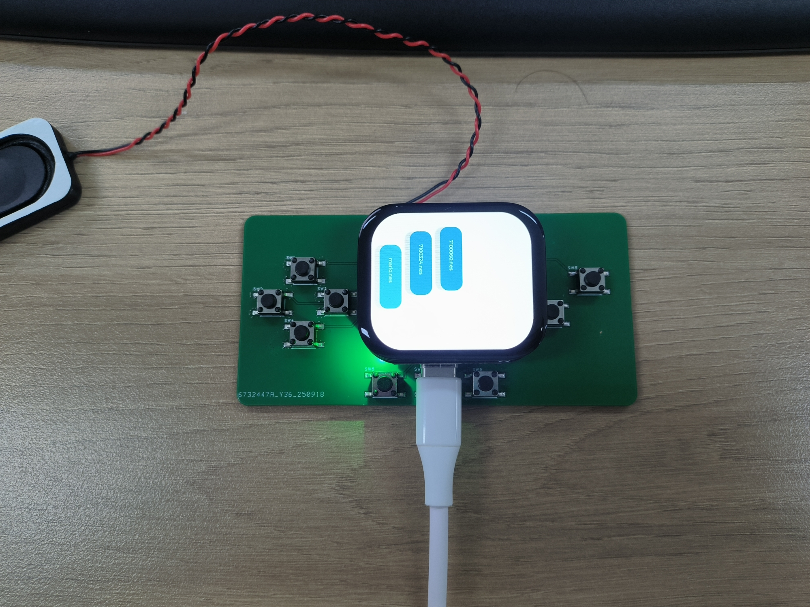

# PocketPi

[English](README_EN.md) | [中文](README.md)

一个基于 sf32lb52 模组的嵌入式游戏/演示工程（PocketPi）。此仓库包含源代码、构建脚本与运行所需的资源目录。

## 支持的开发板
- [立创·黄山派SF32LB52-ULP开发板](https://lckfb.com/project/detail/lckfb-hspi-sf32lb52-ulp?param=baseInfo)

## 快速开始

### 克隆仓库

```
git clone https://github.com/SiFliSparks/PocketPi.git
```

### 编译和烧录

切换到project目录，运行scons命令执行编译：
```
scons --board=sf32lb52-lchspi-ulp -j32
```

运行`build_sf32lb52-lchspi-ulp_hcpu\uart_download.bat`，按提示选择端口即可进行下载：

```
build_sf32lb52-lchspi-ulp_hcpu\uart_download.bat

Uart Download

please input the serial port num:5
```

### 运行游戏

烧录并启动设备后，固件会自动扫描设备上的 `disk/` 目录，列出目录中的可运行文件。请注意以下要点：

- 在构建或调试时，用户需自行准备要运行的 ROM/二进制文件并把它们放入仓库根的 `disk/` 目录中（请勿将受版权保护的 ROM 提交到仓库）。
- 启动后，设备会扫描 `disk/` 并在界面上显示文件列表。你可以在列表中选择某个文件并运行它。

示例流程：

1. 在本地把测试用 ROM 拷贝到 `disk/` 目录。
2. 启动设备，等待主界面扫描完成并显示列表。
3. 在界面中选择要运行的文件并确认，设备会载入并运行该文件。

### 运行效果
游戏列表：

游戏运行：


## 目录结构
仓库中主要文件和目录说明：

- `disk/`：运行时扫描的资源目录，放置本地测试用的 ROM/二进制文件，请勿提交受版权保护的 ROM。
- `project/`：构建脚本、板级配置和生成的构建产物。
- `src/`：工程源代码（C 源文件、第三方库子目录等）。
- `assets/`：示例图片和运行截图。
- `.gitignore`：忽略规则，已配置为忽略构建输出和常见 ROM 文件扩展名。
- `README.md`：工程介绍与使用说明（本文件）。

通常流程：编辑 `disk/`（放入本地测试文件）→ 运行 `scons` 构建 `project/` → 通过下载脚本烧录并在设备上选择运行。

## 硬件按键与 IO

本工程把游戏按键通过外部引出的 GPIO 实现，相关实现位于 `src/video_audio.c`（部分行为在 `src/main.c` 中被调用）。

- 按键硬件定义：

	- 按键 GPIO 数组：`int key_pin_def[] = {30,24,25,20,10,11,27,28,29};`（共 9 个按键，板上使用上拉输入）。

- 扫描与去抖：

	- 使用 200 Hz 的软件定时器周期性调用 `key_scan()`。
	- 每个按键用 8-bit 移位缓冲做去抖：连续读到 `0xFF` 判定为按下，连续 `0x00` 判定为释放。

- 按键索引到功能的映射（索引 0..8）：

- 按键索引与 GPIO、功能（表格）：

| 索引 | GPIO 引脚 | 按键名称 | 说明 | Select+组合键（按住 Select 时） |
|------:|:---------:|:--------|:-----|:--------------------------------|
| 0 | 30 | Select | 主组合键，用于触发系统级快捷操作 游戏Select键| — |
| 1 | 24 | 未使用 | 当前未分配功能 | — |
| 2 | 25 | Start | 游戏 Start 按键 | Select + Start → 触发退出（调用 `trigger_quit()`） |
| 3 | 20 | B | 游戏 B 按键 | Select + B → 读取存档（调用 `state_load()`） |
| 4 | 10 | A | 游戏 A 按键 | Select + A → 保存存档（调用 `state_save()`） |
| 5 | 11 | Up | 上 / 菜单上 | Select + Up → 降低音频 shift（`audio_shift_bits--`） |
| 6 | 27 | Right | 右 / 菜单右 | Select + Right → 切到下一个存档槽（`selectedSlot++`，并调用 `state_setslot()`） |
| 7 | 28 | Left | 左 / 菜单左 | Select + Left → 切到上一个存档槽（`selectedSlot--`，并调用 `state_setslot()`） |
| 8 | 29 | Down | 下 / 菜单下 | Select + Down → 增加音频 shift（`audio_shift_bits++`） |

说明：表中“Select+组合键”均由 `ConvertGamepadInput()` 中的逻辑判定，判定条件为“Select（索引 0）持续按住且目标键产生按下事件（press event）”。

- 按键事件与仿真输入的关系：

	- 实际送入仿真的按键位由 `ConvertGamepadInput()` 返回的位掩码控制，再由 `osd_getinput()` 中的事件表映射到具体的 `event_` 回调，从而驱动行为（例如 joypad、soft_reset、hard_reset 等）。

- 接线与修改建议：

	- 接线建议：按键一端接对应 GPIO（参考 `key_pin_def` 中的编号），另一端接地；GPIO 使用上拉，按下为低电平。
	- 如果要改变按键对应的功能或组合行为，请修改 `src/video_audio.c` 中的 `key_pin_def`（改变物理引脚）和/或 `ConvertGamepadInput()`（改变按键到事件的映射与组合逻辑），然后重新编译固件。

- 调试与命令：

	- 可以使用 `MSH_CMD_EXPORT` 导出的命令（例如 `key_set`、`tev`、`trigger_quit`）进行简单调试；`key_set` 可用于在运行时注入 `key_state` 值来模拟按键输入。

以上说明基于 `src/video_audio.c` 中的当前实现（包含保存/加载/切槽/退出/音频调整等组合键）。

## 参考链接
- [Sifli 官方仓库](https://github.com/OpenSiFli/SiFli-SDK/tree/main)
- [esplay-retro-emulation](https://github.com/pebri86/esplay-retro-emulation?tab=readme-ov-file)
- [LVGL 官方文档](https://docs.lvgl.io/latest/en/html/index.html)

## 常见问题
Q: 游戏列表中没有文件？
A: 请确保你已经把测试用的 ROM/二进制文件放入了 `disk/` 目录，并且这些文件的扩展名是受支持的（例如 `.nes`）。如果目录为空或没有受支持的文件，列表将不会显示任何内容。

如果你遇到任何问题或有改进建议，请在仓库的 Issues 页提交问题： https://github.com/SiFliSparks/PocketPi/issues
