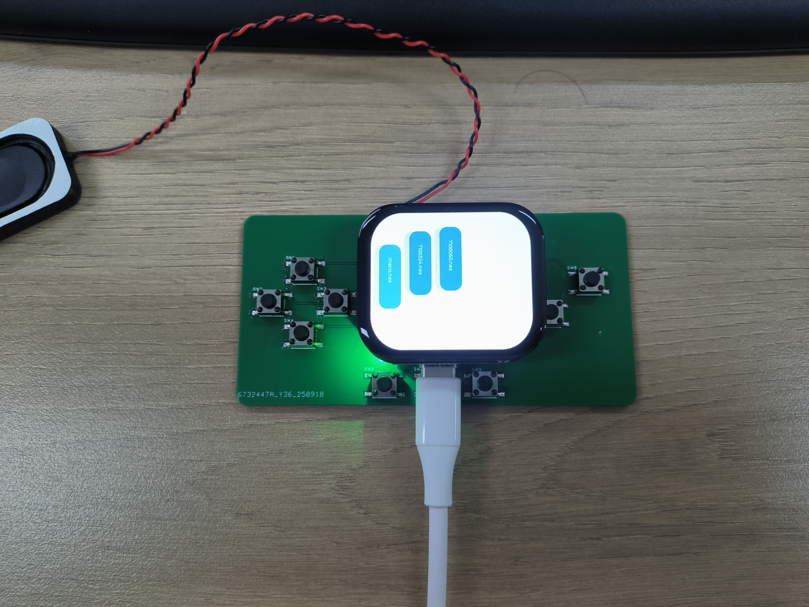
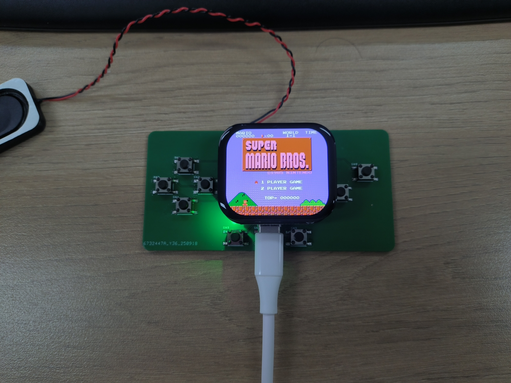

# PocketPi

PocketPi is a small embedded games/demo project based on the SiFli platform. This repository contains source code, build scripts and resource folders needed to build and run on supported boards.

## Quick start

### Clone

```bash
git clone https://github.com/SiFliSparks/PocketPi.git
```

### Build and flash

Change into the `project/` directory and run the SCons build command (replace board name as needed):

```powershell
cd "d:\SIFLI\project\lchspi-extension\PocketPi\project"
scons --board=sf32lb52-lchspi-ulp -j32
```

After building, use the provided download script to flash the device (example for UART download):

```powershell
build_sf32lb52-lchspi-ulp_hcpu\uart_download.bat
# follow prompts and select the serial port
```

## Running games

After flashing and booting the device, the firmware scans the `disk/` directory and lists available files. Notes:

- You must prepare ROM or binary files locally and put them into the repository `disk/` folder for testing. Do NOT commit copyrighted ROM files to the repository.
- On boot the UI displays a file list from `disk/`. Select an item in the list to run it.

Example flow:

1. Copy a test ROM into the repository `disk/` directory.
2. Boot the device and wait for the UI to scan the `disk/` directory.
3. Select a file from the list to launch it.

## Screenshots

Game list view:

Running game:


## Directory structure

Key files and folders:

- `disk/`: runtime resource directory scanned by the firmware. Put local test ROMs/binaries here (do not commit copyrighted ROMs).
- `project/`: build scripts, board configs and build outputs (generated `build_*` folders appear here after building).
- `src/`: project source code (C files and third-party submodules).
- `assets/`: example images and screenshots used in the README.
- `.gitignore`: ignore rules (build outputs, common ROM extensions, etc.).
- `README_EN.md` / `README.md`: project documentation.

Typical flow: edit `disk/` → run `scons` in `project/` → flash using the download script → select and run on device.

## Supported board

- Lichuang SF32LB52-ULP development board (reference): https://lckfb.com/project/detail/lckfb-hspi-sf32lb52-ulp?param=baseInfo

## Hardware buttons and IO

Physical game buttons are exposed through GPIO pins. Implementation details live in `src/video_audio.c` (and `src/main.c`). Highlights:

- GPIO pins used for keys:
  - `int key_pin_def[] = {30,24,25,20,10,11,27,28,29};` (9 keys, configured as input with pull-up)
- Scanning and debouncing:
  - A software timer at ~200 Hz calls `key_scan()` to poll keys.
  - Each key uses an 8-bit shift buffer. `0xFF` indicates stable pressed, `0x00` indicates released (debounce logic).
- Key index → game/system mapping (see `ConvertGamepadInput()`):
  - Index 0: Select (also used with index 5 or 8 release to adjust audio shift)
  - Index 2: Start
  - Index 3: B
  - Index 4: A
  - Index 5: Up
  - Index 6: Right
  - Index 7: Left
  - Index 8: Down
  - Index 1: unused
- Debug / API:
  - `get_key_state(index)` — read current state (0/1)
  - `get_key_press_event(index)` / `get_key_release_event(index)` — read and clear one-shot events
  - MSH command `key_set 0xXXXX` — force `key_state` value for debugging
- Wiring suggestion: one side of each button to the specified GPIO pin, the other side to GND. Pins are configured with internal pull-up; press pulls pin low.

To change pins or mapping, edit `key_pin_def[]` or `ConvertGamepadInput()` in `src/video_audio.c` and rebuild.

## Troubleshooting (FAQ)

- Build fails / scons not found:
  - Cause: Python/SCons not installed or not on PATH.
  - Fix: Install Python and SCons (e.g. `pip install scons`) and run `scons` from `project/`.
- Cross-toolchain or link errors:
  - Cause: Missing cross compiler or wrong environment.
  - Fix: Install the correct toolchain and ensure it is in PATH; check project build configs.
- Device not recognized during flashing:
  - Cause: missing serial driver or wrong port.
  - Fix: check the OS device manager, install drivers, choose correct COM port, close apps that may use port.
- Screen not displaying / LVGL init fails:
  - Cause: wrong LCD device name, framebuffer or wiring issue.
  - Fix: confirm `littlevgl2rtt_init("lcd")` finds the LCD device; check serial logs for errors and verify wiring.
- Buttons not working or unstable:
  - Cause: wrong wiring, not tied to ground, pull-up/pull-down mismatch, or noisy lines.
  - Fix: wire buttons as pull-to-ground, check pin numbers in `key_pin_def[]`, use `key_set` or print `key_state` for debug.
- No audio or noisy audio:
  - Cause: audio device not opened/configured correctly, wrong codec params or DMA settings.
  - Fix: check serial logs for `audprc`/`audcodec` errors, verify caps (sample rate, channels), try adjusting `audio_shift_bits`.
- `disk/` files not scanned:
  - Cause: files not placed in repo `disk/`, or filesystem not mounted.
  - Fix: ensure test files are placed under repository `disk/` (not `project/disk`); check startup logs for mount messages; list files on device.
- ROM crashes or graphics issues:
  - Cause: unsupported mapper or damaged ROM.
  - Fix: test ROM in a desktop emulator first; try another ROM; check logs.
- Accidentally committed ROM files:
  - Quick fix: `git rm --cached disk/<filename>` and commit.
  - To fully remove from history use BFG or `git filter-repo` (destructive operation, force push required).

If your problem is not listed, attach serial logs and steps to reproduce and open an issue.

## Issues

If you find a bug or have suggestions, please open an issue on GitHub: https://github.com/SiFliSparks/PocketPi/issues

---

If you want this README polished, translated back into Chinese, or included inline images in `README.md`, tell me and I will update the files.
